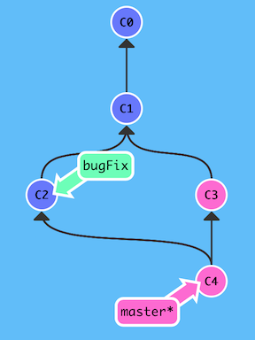
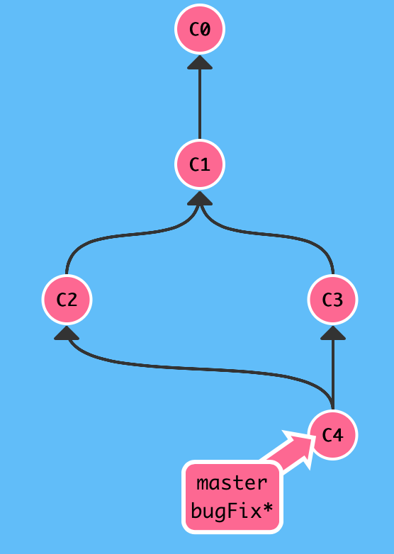

### Questions
- [ ]

- [x] list syntax required (any unordered or ordered list supported)
---

### Misc Notes
- Good tool: http://onlywei.github.io/explain-git-with-d3

---
### From [Learn Git Branching](http://pcottle.github.io/learnGitBranching)

`git commit -a -m <msg>`

Git enthusiasts:
> Branch early, branch often

Easier to logically divide up your work than have big beefy branches

`git checkout -b <new_branch>` = `git branch <new_branch>` + `git checkout <branch>`

`(branchA) git merge <branchB>` creates a special commit that has two unique parents. "Merges branchA into branchB"
* This is the result of merging bugFix into master

>

* Subsequently, this is the result of merging bugFix into master, a **fast-forward merge**.

>

---
### From [Visualizing Git Concepts with D3](http://onlywei.github.io/explain-git-with-d3)

`git reset origin/master` restores local branch to state on origin.
* Will not delete untracked files, use `git clean -df`
